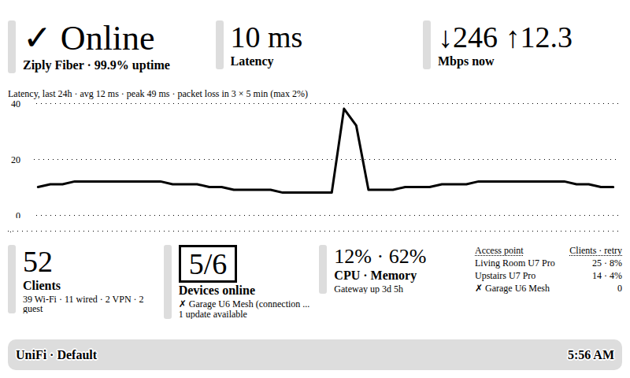

# TRMNL UniFi

Show the health of your UniFi network on a [TRMNL](https://trmnl.com) e-ink display: internet status,
latency over the last 24 hours, live throughput, clients, devices, gateway load, and access points.

Built for a UDM Pro SE. It should work with any UniFi OS console running UniFi Network 9.0 or later
(UDM, UDM Pro, UDR, UCG, UX, Cloud Key Gen2+).



## How it works

```
UniFi console (LAN) ──Network API──▶ unifi_dashboard.py ──webhook POST──▶ TRMNL ──▶ your display
api.ui.com ─────Site Manager API───▶        │
```

A small service on your LAN reads two official, API-key based UniFi APIs every few minutes and **pushes**
a compact summary to a TRMNL *webhook* private plugin. No port forwarding or tunnel is needed.

| On screen | Source |
|---|---|
| Online / Degraded / Offline | gateway state and internet status (local) + internet issues and packet loss (cloud) |
| ISP, WAN uptime % | Site Manager `GET /v1/sites` |
| Latency now, 24h chart, packet loss | Site Manager `GET /v1/isp-metrics/5m?duration=24h` |
| ↓ / ↑ Mbps now | WAN rates from classic `stat/health`, else gateway `statistics/latest` → `uplink` |
| CPU, memory, gateway uptime | gateway `statistics/latest`, else classic `stat/health` |
| Clients (Wi-Fi / wired / VPN / guest) | `GET /v1/sites/{id}/clients` |
| Devices online, offline devices, updates | `GET /v1/sites/{id}/devices` (`state`, `firmwareUpdatable`) |
| Clients and Tx retry % per access point | clients' `uplinkDeviceId` + each AP's `statistics/latest` |
| PoE watts used / budget | classic `GET /proxy/network/api/s/{site}/stat/device` (see below) |
| Last speed test: down, up, ping, when | classic `GET /proxy/network/api/s/{site}/stat/health` (see below) |

The cloud key is optional. Without it you still get everything from the console, but no ISP name, latency
chart or packet loss.

The official APIs don't expose Wi-Fi signal strength or per-client bandwidth, so those aren't shown.

**PoE and speed tests come from UniFi's older, undocumented API**, because the official one doesn't
report PoE watts (only whether a port supplies power) or speed test results. UniFi OS accepts the same
API key there, but Ubiquiti doesn't guarantee that. If your console rejects it, `check` says so, one line
is logged, and the dashboard shows everything else.

The classic `stat/health` data also fills gaps in the official API: some consoles (a UDM Pro SE on
Network 10.6, for one) don't mark themselves as a gateway in the official device list, so the gateway is
found by the MAC address in `stat/health`, which also supplies its CPU, memory, WAN rates and internet
status. The same MAC picks the right cloud site when several consoles each have a "Default" site.

- Switches report a PoE budget (`total_max_power`); gateways may not, so their PoE draw is shown as
  "+N W" beside the bar rather than in it.
- The speed test shown is the gateway's latest one, as in UniFi Network's Internet panel. The dashboard
  doesn't start tests, so turn on automatic speed tests in UniFi Network's settings to keep it fresh.

## Setup

### 1. Create API keys

- **Network API key (required):** in UniFi Network, go to **Settings → Control Plane → Integrations**, and
  create an API key. It's shown once, so copy it straight away.
- **Site Manager API key (recommended):** at [unifi.ui.com](https://unifi.ui.com) go to **Settings → API Keys**
  (<https://unifi.ui.com/settings/api-keys>) and create a key. It's read-only.

### 2. Create the TRMNL plugin

1. In TRMNL, go to **Plugins → Private Plugin → New**, name it *UniFi*, and set **Strategy: Webhook**.
2. Save the plugin, then copy the **Webhook URL** it shows.
3. Open **Edit Markup**. Paste `markup/full.liquid` into the *Full* tab and `markup/quadrant.liquid` into the
   *Quadrant* (and optionally *Half*) tabs.
4. Add the plugin to a playlist.

### 3. Install on an always-on machine on your LAN

Any Debian/Ubuntu box, VM, Raspberry Pi or Proxmox LXC that can reach the console works. Run as root
(for a Proxmox LXC, `pct enter <id>` first):

```bash
curl -fsSL https://raw.githubusercontent.com/nguyenware/trmnl-unifi/main/install.sh | bash
```

The installer:
- installs `python3-venv` and `git`
- clones the repo to `/opt/trmnl-unifi` and sets up a virtualenv
- creates a `trmnl-unifi` system user
- creates `.env` from the example, readable only by root and the service
- installs and enables the `trmnl-unifi` systemd service

Running it again updates to the latest `main` and keeps your `.env`.

### 4. Configure and start

```bash
nano /opt/trmnl-unifi/.env        # UNIFI_HOST, UNIFI_API_KEY, UNIFI_CLOUD_API_KEY, TRMNL_WEBHOOK_URL
cd /opt/trmnl-unifi
runuser -u trmnl-unifi -- .venv/bin/python unifi_dashboard.py check   # tests both keys, lists sites
runuser -u trmnl-unifi -- .venv/bin/python unifi_dashboard.py once    # prints the payload and its size
systemctl restart trmnl-unifi
journalctl -u trmnl-unifi -f      # expect "Pushed internet=up latency=..." every PUSH_INTERVAL seconds
```

## Settings (`.env`)

| Variable | Default | Notes |
|---|---|---|
| `TRMNL_WEBHOOK_URL` | – | Required for `push` mode. |
| `UNIFI_HOST` | – | Console address, e.g. `192.168.1.1` or `https://unifi.lan`. |
| `UNIFI_API_KEY` | – | Network API key from Settings → Control Plane → Integrations. |
| `UNIFI_SITE` | first site | Site name, internal name (`default`) or id. |
| `UNIFI_VERIFY_SSL` | `0` | Consoles use a self-signed certificate. Set `1` if yours has a trusted one. |
| `UNIFI_CA_BUNDLE` | – | Path to a CA file to verify the console's certificate. |
| `UNIFI_CLOUD_API_KEY` | – | Site Manager key. Adds ISP, WAN uptime, latency and packet loss. |
| `SHOW_POE` | `1` | `0` stops reading PoE from the classic API. |
| `SHOW_SPEEDTEST` | `1` | `0` stops reading speed test results from the classic API. |
| `UNIFI_CLOUD_SITE_ID` | auto | Matched by the gateway's MAC address. Only needed if `check` still can't match the site. |
| `PUSH_INTERVAL` | `300` | Seconds. TRMNL allows 12 webhook posts per hour (30 with TRMNL+), so don't go below 300 (120 with TRMNL+). |
| `PAYLOAD_LIMIT` | `2048` | Webhook body limit in bytes; `5120` with TRMNL+. A typical payload is under 1 KB. |
| `TIME_FORMAT` | `%I:%M %p` | Update time in the title bar, in this machine's time zone. |
| `HOST`, `PORT` | `0.0.0.0`, `5000` | `serve` mode only. |

## Modes

```bash
python unifi_dashboard.py push    # default: POST to the TRMNL webhook every PUSH_INTERVAL seconds
python unifi_dashboard.py once    # print the payload once and exit
python unifi_dashboard.py check   # test the API keys and show which sites were found
python unifi_dashboard.py serve   # serve the payload at http://<host>:5000/unifi
```

`serve` is for a **polling** plugin, e.g. a self-hosted BYOS server (Terminus, LaraPaper, …) on your LAN.
The JSON is the same as the webhook payload, so the same markup works.

If the console can't be reached three times in a row, the service pushes an error payload so the display
shows "UniFi unreachable" instead of stale numbers.

## Payload

The variables available in the markup:

| Variable | Example | Notes |
|---|---|---|
| `status` | `ok` | `error` when the console is unreachable; then only `error` and `updated` are set. |
| `internet` | `up` | `up`, `degraded` (packet loss or internet issues), `down` (gateway offline), or `unknown` (no cloud key). |
| `why` | `packet loss 3%` | Why the status isn't `up`: packet loss, a current internet issue (e.g. `WAN down`), a UniFi health warning, or the gateway's state. When up, the most recent issue from the last day if any, e.g. `WAN down 19h ago`. |
| `isp`, `wan_uptime` | `Ziply Fiber`, `99.9` | cloud |
| `latency`, `latency_avg`, `latency_max` | `10`, `12`, `49` | ms; latest 5-minute sample, 24h average, 24h peak. |
| `loss`, `loss_max`, `lossy` | `0`, `2`, `3` | packet loss % now and 24h max, and how many 5-minute intervals had any loss. |
| `lat` | `[10, 11, …]` | 48 points: 24h of latency averaged into 30-minute buckets, oldest first; `null` for gaps. |
| `down`, `up` | `246`, `12.3` | Mbps through the gateway's WAN right now. |
| `gateway`, `cpu`, `mem`, `uptime` | `Dream Machine Pro SE`, `12`, `62`, `3d 5h` | |
| `clients` | `{"wifi": 39, "wired": 11, "vpn": 2, "guest": 2, "total": 52}` | Guests are also counted as Wi-Fi or wired. |
| `devices`, `online`, `offline` | `6`, `5`, `["Garage U6 Mesh (connection interrupted)"]` | up to 4 names |
| `updates`, `alerts` | `1`, `0` | devices with firmware updates, critical notifications (cloud) |
| `aps` | `[{"n": "Living Room", "c": 25, "on": true, "r": 8}]` | name, clients, online, highest Tx retry % across radios; up to 6, busiest first |
| `poe` | `{"w": 87, "max": 400, "pct": 22, "other": 12, "hot": ""}` | PoE watts drawn and budget over devices that report a budget, % of budget, watts on devices without a budget (e.g. the gateway's own PoE ports), and the name and % of any device at 80%+ of its budget. `null` if unavailable or `SHOW_POE=0`. |
| `speedtest` | `{"down": 999, "up": 1017, "ping": 10, "ago": "3h", "ok": true}` | Latest gateway speed test in Mbps and ms, how long ago it ran, and whether it succeeded. `null` if no test has run, it's unavailable, or `SHOW_SPEEDTEST=0`. |
| `site`, `time`, `updated` | `Default`, `5:56 AM`, `1790747811` | |

## Development

```bash
pip install -r requirements.txt pytest
python -m pytest
```

The tests use responses shaped like the examples in Ubiquiti's OpenAPI specs
([Network API](https://developer.ui.com/network/v10.6.106/gettingstarted),
[Site Manager API](https://developer.ui.com/site-manager/v1.0.0/gettingstarted)).

## License

GPL-3.0.
